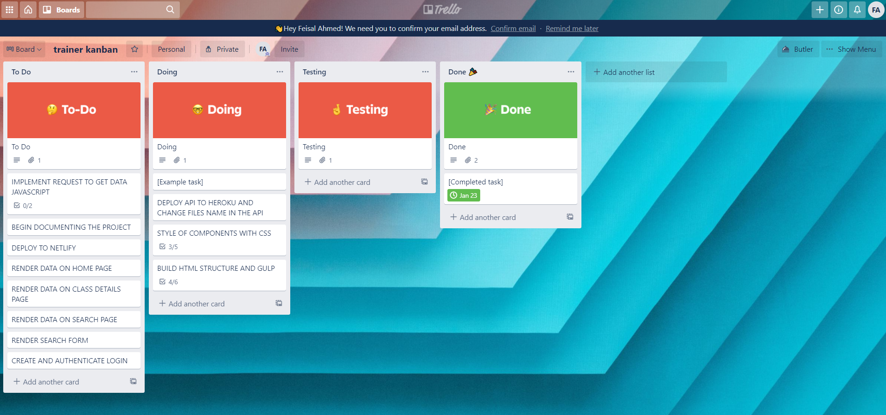
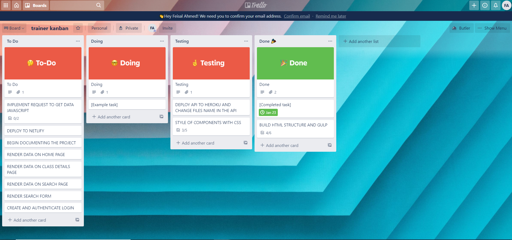
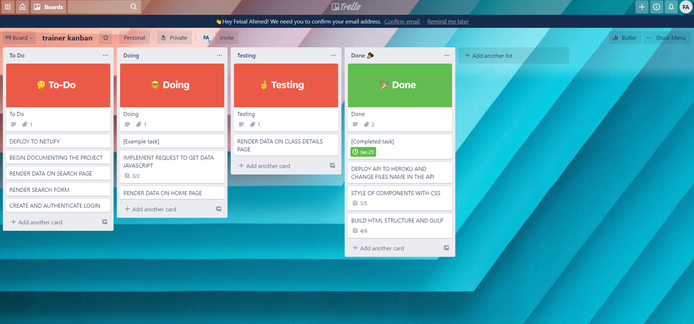
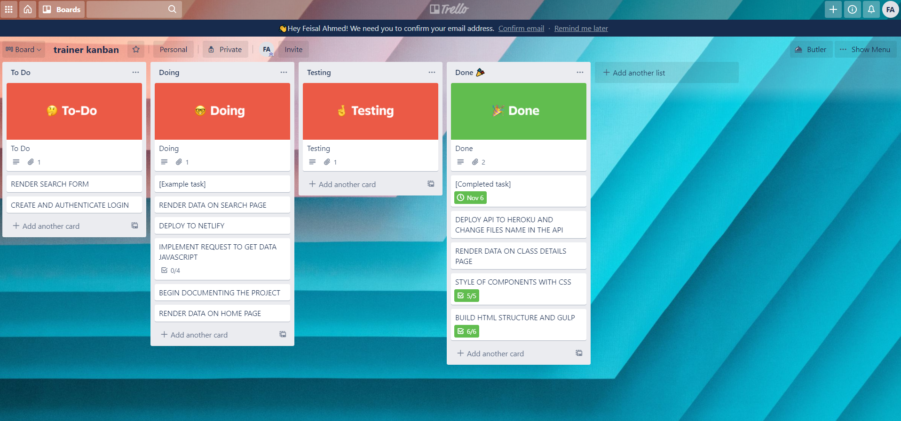
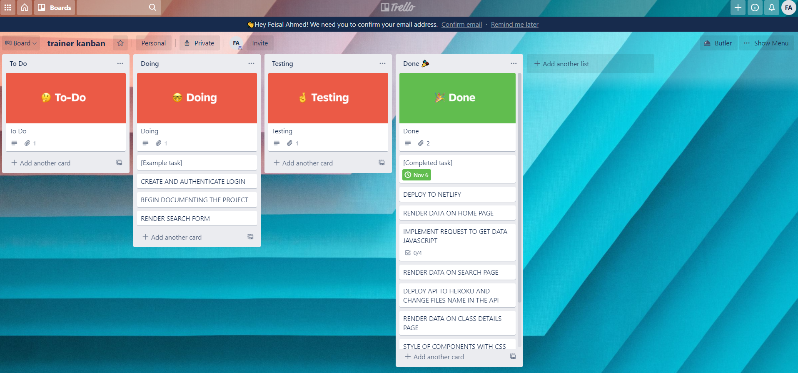

# Fitness Verdan

## Lavet af:

Feisal Ahmed WUHF02
Stack : Gulp, ejs, HTML, Scss, Javascript

Fitness Verdan: https://fitness-verden.netlify.app/

## Vurdering af din egen indsats og gennemførelse af opgaveforløbet

Jeg synes der har gået godt med opgaven. startede med at planlægge mit kanban
board så jeg kunne visualisere hvordan sitet skal se ude. Jeg føler at begyndte stærkt, der jeg
var allrede færdig med html strukturen og har stylede layoutet super godt

Jeg har opleve nogen problemer med at login der
jeg brugt en del tid for at rette den til.
Hvis man bruger meget tid på et løsning burde man lave noget andet for at ikke
spille med tiden. Det den stratagi jeg vælgt at tage.

## Argumentation for de valg du selvstændigt har truffet under løsningen af opgaven

Fra Onsdag begyndte jeg og hent data fra apiet, men fordi jeg bruger heroku til
at host mit api, skulle jeg skifte alle navne på billeder fra localhost til
heroku url manuelt. Defor har jeg lavet et script som skifter navnet på alle assets som hat
localhost in urlen

```javascript
(async () => {
  let assets = await Asset.findAll();
  for (const asset of assets) {
    if (asset.url.includes("http://localhost:4000")) {
      asset.update({
        url: asset.url.replace(
          "http://localhost:4000/",
          process.env.API_ENDPOINT
        ),
      });
    }
  }
})();
```

### Applikation stack

### :HTML

Jeg har valgt at arbejde med Ejs. E i Ejs er til Embedded, Ejs er enkel og effektiv template motor til Javascript. Grunden til at jeg bruger det er fordi, den giver mig mulighed for at oprette Html-siden med almindeligt javascript. Ejs giver hurtigt kompilering og includere både server og browsersupport.

```html
<%- include('../partials/head') %> <%- include('../partials/head_end') %> <%-
include('../partials/navigation') %>

<form id="form1" action="/" onsubmit="return validate(this)" method="post">
  <div><input type="text" name="name" placeholder="Name" /></div>
  <div><input type="text" name="age" placeholder="Your Age" /></div>
  <div><input type="text" name="email1" placeholder="Your Email" /></div>
  <div><input type="text" name="email2" placeholder="Repeat Your Email" /></div>
  <div><input type="text" name="site" placeholder="Your Website" /></div>
  <div><input type="submit" value="Send tilmelding" /></div>
  <div id="message"></div>
</form>

<%- include('../partials/footer') %>
<script src="../../../assets/js/navigation.js"></script>
<script src="../../../assets/js/contact.js"></script>
```

### SASS:

Grund til jeg valgt Sass er fordi, Sass reducere gentagelser af CSS og spare tid og giver muligheder for at lave mit stylesheet mere dynamisk med bruges af Variabler

```scss
.search {
  margin: 0 2rem 12rem;
  &__title {
    font-size: $fs-large;
    text-transform: capitalize;
    margin: 1rem 0;
  }
  &__container {
    margin-bottom: 1rem;
    position: relative;
  }
```

### JavaScript:

Javascript er hoveddelen af projektet. Jeg arbejde med Vanilla js fordi det der
hvor jeg føler mest trygt. Jeg bruger det til at, hente data fra api’ede,
validere mit kontakt form, funtionalitet for et slider, menu baren.

For ikke at gentage migselv har også vaglte a lave nogen async functioner som er
IIFE's

```javascript
async function apiLink(url) {
  data = await pageData(url);
  getToken = await token();

  return data;
}
```

```javascript
(async function () {
  const data = await apiLink(
    "https://trainers-api.herokuapp.com/api/v1/classes/4"
  );

  const list = await apiLink(
    "https://trainers-api.herokuapp.com/api/v1/classes"
  );
  //console.log(list)

  document.querySelector(".home__title").innerText = data.className;
  document.querySelector(
    ".home__top"
  ).style.backgroundImage = `url(${data.asset.url})`;

  list.forEach((element) => {
    console.log(element);
    const homeTemplate = document.querySelector(".home__template");
    const container = document.querySelector(".home__btm");
    const clone = homeTemplate.content.cloneNode(true);

    clone.querySelector(".home__class-name").innerText = element.className;
    clone.querySelector(".home__class-img").src = element.asset.url;
    clone.querySelector(
      ".home__details-link"
    ).href = `/details?id=${element.id}`;

    container.appendChild(clone);
  });
})();
```

### GULP:

Grunden til at jeg bruger gulp er fordi, gulp er et task runner. Det bygger og
compilere alle mine HTML, CSS, JavaScript og bilede filer.

Mit projekt er blevet kodet med HTML Scss og Javascript. Jeg arbejder med Ejs og Gulp, da jeg føler mig tryg i at kode med dette setup og synes det var et godt setup i forhold til den udleverede opgave.

Jeg har også valgt at min navngivningsstruktur på mine classes er BEM Dette foretrækker jeg til hver en tid over specificity, da det er meget nemmere at have kontrol med importance når alt ligger i klasser.

## En beskrivelse af særlige punkter til bedømmelse

## Kanban board

[Feisal Ahmed - Kanban board](https://trello.com/b/es7X2qJ2/svendepr%C3%B8ve-kanban)






